<div align="center">

# 🎓 University Database Management System

**A comprehensive, production-style relational database for managing university academics and library operations.**


</div>

---

## 📖 Overview

This project implements a comprehensive relational database management system designed to manage core operations for a modern university. It is structured into two interconnected schemas — **Education** and **Library** — providing a holistic solution for academic and resource management.

The database is built on **Microsoft SQL Server**, and the codebase is designed to be clean, organized, and easily navigable, with consistent naming conventions and formatting throughout.

## 📑 Table of Contents

- [Key Features](#-key-features)
- [Entity Relationship Diagram](#-entity-relationship-diagram)
- [Technologies Used](#-technologies-used)
- [Project Structure](#-project-structure)
- [Setup and Installation](#-setup-and-installation)
- [Usage and Testing](#-usage-and-testing)
- [Acknowledgments](#-acknowledgments)

## ✨ Key Features

### 🧩 Modular Design
- **Education Schema** — Manages all academic aspects, including students, instructors, departments, courses, enrollments, and academic progress.
- **Library Schema** — Handles library resources, including books, authors, publishers, book copies, member borrowings, returns, and fines.

### 🔗 Cross-Schema Interactivity
- **Automatic Library Account Creation** — Student registration in the Education schema automatically creates a corresponding library member account.
- **Library Access Deactivation** — Student status changes (e.g., graduation, expulsion) in the Education schema automatically deactivate their library borrowing privileges.
- **National ID Validation** — Ensures the integrity of national identification codes for all new student, instructor, and admin registrations.

### 🧠 Smart Recommendation Systems
- **Course Suggestion** — Recommends courses to students based on their major's curriculum plan, unpassed courses, and term acquisition priority.
- **Book Recommendation** — Implements a collaborative filtering algorithm to suggest books to library members based on the borrowing patterns of similar users.

### 🛡️ Robust Data Management
- **Normalized Design** — Tables follow normalization principles to minimize data redundancy and improve integrity.
- **Comprehensive Data Operations** — Includes DDL (schema/table creation) and DML (insertion, deletion, updates).
- **Transactional Integrity** — Critical operations are encapsulated within transactions to ensure atomicity and consistency.

### 🔐 Role-Based Access Control
Database roles (**Admin**, **Librarian**, **Student**) are defined with specific granular permissions — e.g., `INSERT` for Admins, `EXECUTE` for Librarians on borrowing procedures, `SELECT` on relevant views for Students — to enforce security and separation of duties.

### 🗂️ Code Organization
- **Unified Naming Conventions** — All tables, columns, functions, stored procedures, and triggers follow a consistent, descriptive naming standard.
- **Clean Codebase** — Uniform formatting style throughout for improved readability.
- **Structured Project Layout** — Files are logically grouped into folders by schema and script type, simplifying navigation and maintenance.

## 🗺️ Entity Relationship Diagram

```mermaid
erDiagram
    %% EDUCATION SCHEMA
    Departments {
        int DepartmentID PK
        nvarchar DepartmentName UK
    }
    Majors {
        int AcademicMajorID PK
        nvarchar MajorTitle
        int ResponsibleDepartmentID FK
    }
    Students {
        int UniversityStudentID PK
        nvarchar NationalIdentityNumber UK
        int EnrolledDepartmentID FK
        int ChosenMajorID FK
    }
    Instructors {
        int FacultyMemberID PK
        nvarchar NationalIdentityCode UK
        int AssignedDepartmentID FK
    }
    Courses {
        int CurriculumCourseID PK
        nvarchar OfficialCourseName UK
        int AssociatedMajorID FK
        int OwningDepartmentID FK
    }
    Semesters {
        int AcademicTermID PK
        nvarchar TermIdentifier UK
    }
    CourseOfferings {
        int CourseOfferingID PK
        int OfferedCourseID FK
        int OfferingSemesterID FK
        int AssignedInstructorID FK
    }
    ClassSchedules {
        int ClassScheduleID PK
        int CourseOfferingID FK
    }
    ExamSchedules {
        int ExaminationScheduleID PK
        int ScheduledOfferingID FK
    }
    Enrollments {
        int CourseEnrollmentID PK
        int EnrolledStudentID FK
        int EnrolledOfferingID
    }
    StudentCourses {
        int StudentCourseRecordID PK
        int RelatedEnrollmentID FK
    }
    StudentStatusChanges {
        int StatusChangeLogID PK
        int AffectedStudentID FK
        int ReportingSemesterID FK
    }
    CurriculumPlan {
        int CurriculumPlanRecordID PK
        int MajorProgramID FK
        int CourseInCurriculumID FK
    }
    Admins {
        int AdministratorID PK
        nvarchar NationalIdentifier UK
    }
    Addresses {
        int AddressIdentifier PK
        nvarchar AssociatedEntityID UK
    }
    Userlink {
        int EntityLinkID PK
        nvarchar LinkedEntityNationalCode UK
    }
    UserAccounts {
        nvarchar UserNationalCode PK
    }
    EventLogs {
        int LogEntryID PK
    }

    %% LIBRARY SCHEMA
    Authors {
        int AuthorIdentifier PK
    }
    Publishers {
        int BookPublisherID PK
    }
    Categories {
        int BookCategoryID PK
    }
    Books {
        int BookID PK
        int PublishingHouseID FK
        int LiteraryCategoryID FK
    }
    BookAuthors {
        int BookID PK,FK
        int AuthorID PK,FK
    }
    BookCopies {
        int BookCopyID PK
        int AssociatedBookID FK
    }
    Members {
        int LibraryMemberID PK
        int AssociatedStudentID FK
    }
    Borrowing {
        int BorrowingRecordID PK
        int LibraryMemberID FK
        int BorrowedCopyID FK
    }
    Returns {
        int BookReturnID PK
        int RelatedBorrowingRecordID FK
    }
    Fines {
        int FineRecordID PK
        int MemberAccountID FK
    }
    BorrowingActivityLog {
        int ActivityLogEntryID PK
    }

    %% RELATIONSHIPS (Education)
    Departments ||--o{ Majors : "has"
    Departments ||--o{ Students : "enrolls"
    Departments ||--o{ Instructors : "employs"
    Departments ||--o{ Courses : "owns"

    Majors ||--o{ Students : "has"
    Majors ||--o{ Courses : "associates"
    Majors ||--o{ CurriculumPlan : "plans"

    Students ||--o{ Enrollments : "makes"
    Students ||--o{ StudentStatusChanges : "logs"

    Instructors ||--o{ CourseOfferings : "assigned_to"

    Courses ||--o{ CourseOfferings : "offered_as"
    Courses ||--o{ CurriculumPlan : "included_in"

    Semesters ||--o{ CourseOfferings : "runs_in"
    Semesters ||--o{ StudentStatusChanges : "records"

    CourseOfferings ||--o{ ClassSchedules : "scheduled_in"
    CourseOfferings ||--o{ ExamSchedules : "examined_in"
    CourseOfferings ||--o{ Enrollments : "receives"

    Enrollments ||--o{ StudentCourses : "contains"
    Userlink ||--o| UserAccounts : "authenticates"

    %% RELATIONSHIPS (Library)
    Students ||--o| Members : "registers_as"

    Publishers ||--o{ Books : "publishes"
    Categories ||--o{ Books : "categorizes"

    Books ||--o{ BookAuthors : "written_by"
    Authors ||--o{ BookAuthors : "writes"

    Books ||--o{ BookCopies : "has_copy"

    Members ||--o{ Borrowing : "initiates"
    Members ||--o{ Fines : "incurs"

    BookCopies ||--o{ Borrowing : "is_borrowed"

    Borrowing ||--o| Returns : "returned_via"
    Borrowing ||--o{ BorrowingActivityLog : "logs"
```



## 🛠️ Technologies Used

| Category | Technology |
|---|---|
| **Database System** | Microsoft SQL Server |
| **Management Tool** | SQL Server Management Studio (SSMS) |
| **Language** | T-SQL |

## 📁 Project Structure

```
Your_Project_Root/
├── Database_Setup/              # Scripts for initial database and security setup
├── Education_Schema/            # Scripts for the academic and administrative schema
│   ├── DDL/                     # Table definitions
│   ├── Data_Inserts/            # Scripts to insert test data
│   ├── Data_Deletes/            # Scripts to delete existing data
│   ├── Functions/               # User-defined functions
│   ├── Stored_Procedures/       # Stored procedures
│   └── Triggers/                # Database triggers
└── Library_Schema/              # Scripts for the university library schema
    ├── DDL/                     # Table definitions
    ├── Data_Inserts/            # Scripts to insert test data
    ├── Data_Deletes/            # Scripts to delete existing data
    ├── Functions/               # User-defined functions
    ├── Stored_Procedures/       # Stored procedures
    └── Triggers/                # Database triggers
```

## 🚀 Setup and Installation

### Prerequisites
- Microsoft SQL Server (e.g., Express or Developer Edition)
- SQL Server Management Studio (SSMS)

### Installation Steps

**1. Create the Database**

Open SSMS, connect to your SQL Server instance, and execute:
```
Database_Setup/01_Create_Database.sql
```

**2. Create Schemas**

Execute the following scripts:
```
Database_Setup/02_Create_Education_Schema.sql
Database_Setup/03_Create_Library_Schema.sql
```

**3. Create Tables (DDL)**

Navigate to the `Education_Schema/DDL/` and `Library_Schema/DDL/` folders and execute the `.sql` files **in order** to satisfy foreign key dependencies:

<details>
<summary><b>Education Schema — recommended order</b></summary>

1. `EDU_01_Admins_Table.sql`
2. `EDU_03_Departments_Table.sql`
3. `EDU_04_Majors_Table.sql`
4. `EDU_05_Students_Table.sql` — depends on Departments, Majors
5. `EDU_06_Instructors_Table.sql` — depends on Departments
6. `EDU_15_Userlink_Table.sql`
7. `EDU_16_UserAccounts_Table.sql` — depends on Userlink
8. `EDU_02_Addresses_Table.sql`
9. `EDU_07_Courses_Table.sql` — depends on Majors, Departments
10. `EDU_08_Semesters_Table.sql`
11. `EDU_09_CourseOfferings_Table.sql` — depends on Courses, Instructors, Semesters
12. `EDU_10_ClassSchedules_Table.sql` — depends on CourseOfferings
13. `EDU_11_ExamSchedules_Table.sql` — depends on CourseOfferings
14. `EDU_12_Enrollments_Table.sql` — depends on Students, CourseOfferings
15. `EDU_13_StudentCourses_Table.sql` — depends on Enrollments
16. `EDU_14_StudentStatusChanges_Table.sql` — depends on Students, Semesters
17. `EDU_17_EventLogs_Table.sql`
18. `EDU_18_CurriculumPlan_Table.sql` — depends on Majors, Courses

</details>

<details>
<summary><b>Library Schema — recommended order</b></summary>

1. `LIB_01_Authors_Table.sql`
2. `LIB_02_Publishers_Table.sql`
3. `LIB_03_Categories_Table.sql`
4. `LIB_04_Books_Table.sql` — depends on Publishers, Categories
5. `LIB_05_BookAuthors_Table.sql` — depends on Books, Authors
6. `LIB_06_BookCopies_Table.sql` — depends on Books
7. `LIB_07_Members_Table.sql` — depends on Education.Students
8. `LIB_08_Borrowing_Table.sql` — depends on Members, BookCopies
9. `LIB_09_Returns_Table.sql` — depends on Borrowing
10. `LIB_10_Fines_Table.sql` — depends on Members
11. `LIB_11_BorrowingActivityLog_Table.sql`

</details>

**4. Create Functions, Stored Procedures, and Triggers**

Execute all `.sql` files within the respective `Functions`, `Stored_Procedures`, and `Triggers` folders for both `Education_Schema` and `Library_Schema`. Order within these subfolders generally doesn't matter, since they reference tables that already exist.

**5. Insert Test Data**

Execute the `.sql` files in `Education_Schema/Data_Inserts/` and `Library_Schema/Data_Inserts/`, respecting the numerical prefixes due to foreign key dependencies:

<details>
<summary><b>Education data insertion order</b></summary>

```
EDU_Data_01_Departments_Insert.sql
EDU_Data_02_Majors_Insert.sql
EDU_Data_03_Courses_Insert.sql
EDU_Data_04_Semesters_Insert.sql
EDU_Data_05_Admins_Addresses_Insert.sql
EDU_Data_06_Instructors_Addresses_Insert.sql
EDU_Data_07_Students_Addresses_Insert.sql
EDU_Data_08_UserAccounts_Insert.sql
EDU_Data_09_Advisors_Insert.sql
EDU_Data_10_CurriculumPlan_Insert.sql
EDU_Data_11_CourseOfferings_Insert.sql
EDU_Data_12_ClassSchedules_Insert.sql
EDU_Data_13_ExamSchedules_Insert.sql
EDU_Data_14_Enrollments_Insert.sql
EDU_Data_15_Update_Random_Grades_StudentCourses.sql
```

</details>

<details>
<summary><b>Library data insertion order</b></summary>

```
LIB_Data_01_Authors_Insert.sql
LIB_Data_02_Publishers_Insert.sql
LIB_Data_03_Categories_Insert.sql
LIB_Data_04_Books_Insert.sql
LIB_Data_05_BookAuthors_Insert.sql
LIB_Data_06_BookCopies_Insert.sql
LIB_Data_07_Members_Insert.sql
LIB_Data_08_Borrowing_Insert.sql
```

</details>

**6. Set Up Roles and Security**

```
Database_Setup/04_Role_Security_Setup.sql
```

## 🧪 Usage and Testing

After setup, run the provided test scripts to verify functionality:

| Script | Purpose |
|---|---|
| `Final_Project_Test_Script.sql` | Tests core Education schema functionality — data retrieval and stored procedure executions |
| `Library_Test_Script.sql` | Tests core Library schema functionality |

You can connect using the test logins created in `04_Role_Security_Setup.sql` (`TestAdminLogin`, `TestLibrarianLogin`, `TestStudentLogin`) to observe role-based access in action.

## 🙏 Acknowledgments

This database project was developed as part of a university course requirement.

---

<div align="center">

If you find this project useful, consider giving it a ⭐!

</div>
